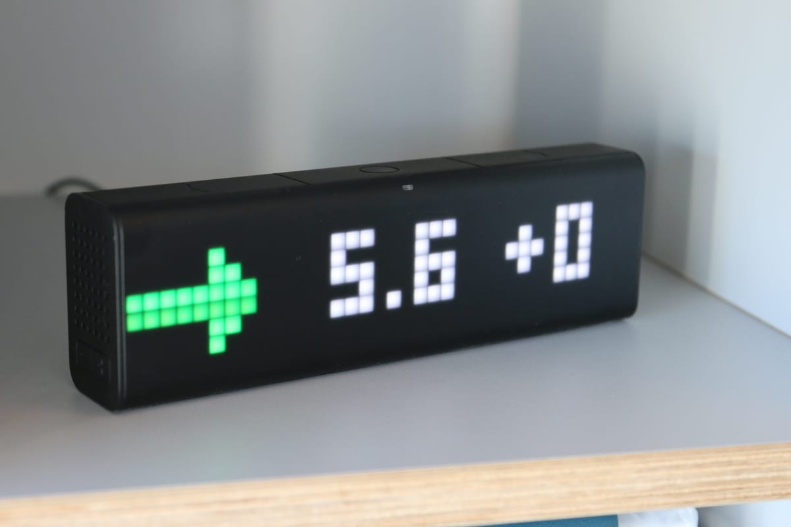
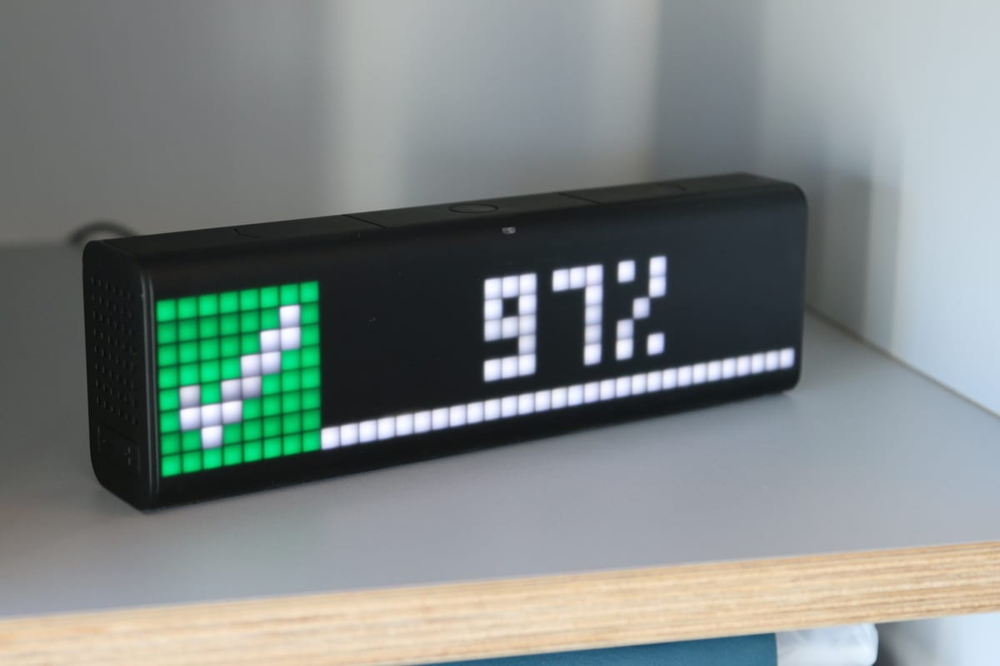
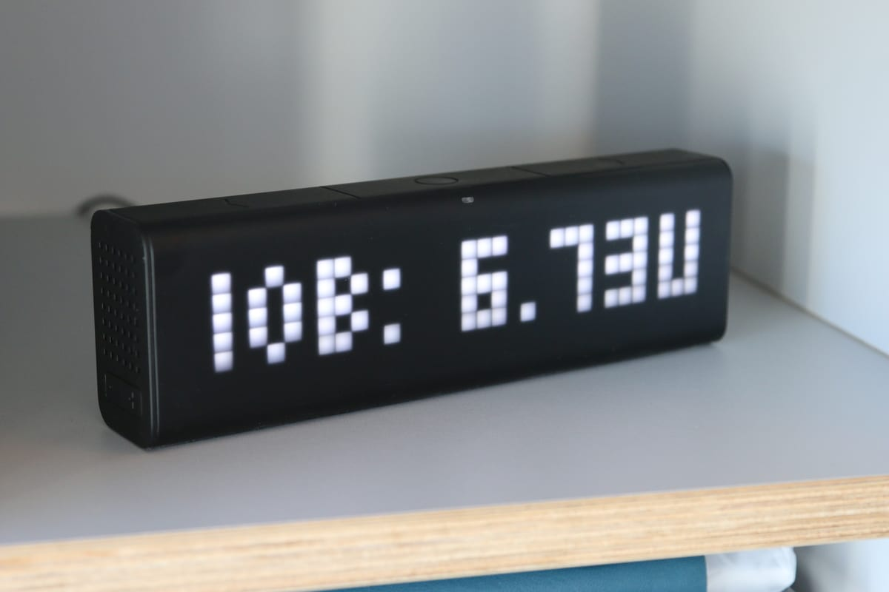
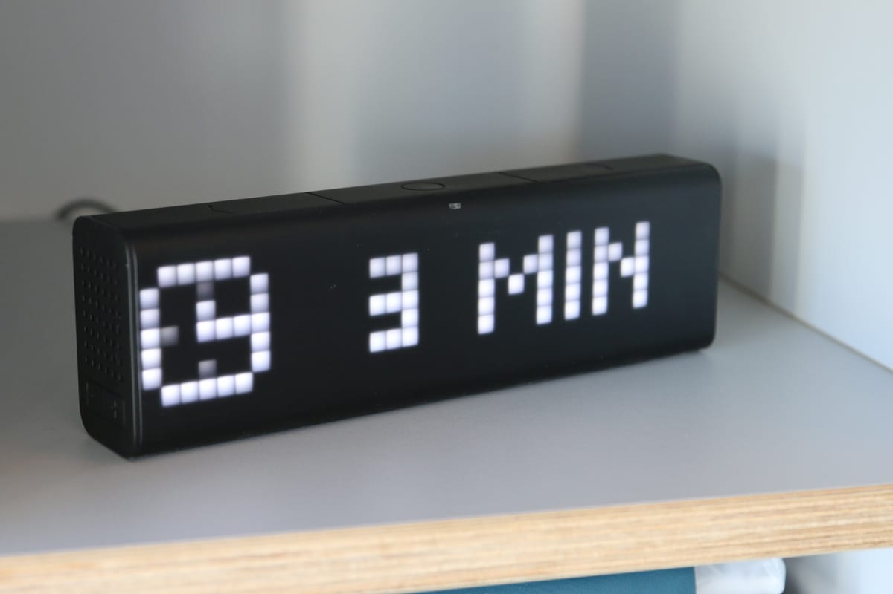
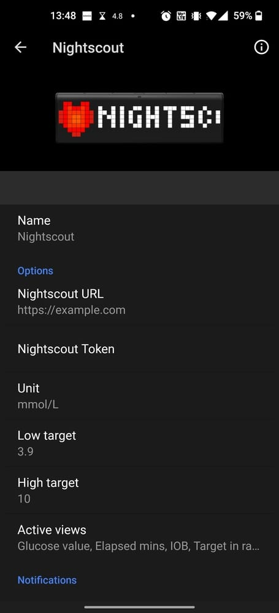

<!--  -->

# lametric-nightscout-proxy

[](https://github.com/aolde/lametric-nightscout-proxy/actions/workflows/release.yml)

This repository contains a backend server that is used to transform data from a Nightscout API to a format that a LaMetric app can read.

[](https://heroku.com/deploy)
[](https://vercel.com/new/clone?repository-url=https%3A%2F%2Fgithub.com%2Faolde%2Flametric-nightscout-proxy&project-name=lametric-nightscout&repo-name=lametric-nightscout)

## LaMetric App

| App showcase                    |                                        |
| ------------------------------- | -------------------------------------- |
| Current glucose                 | Time in range                          |
|   |  |
| Insulin on board                | Minutes since last value               |
|       |          |
| App settings                    |                                        |
|  |                                        |

### App Settings

| ID                       | Title                                | Type             | Options                                                          |
| ------------------------ | ------------------------------------ | ---------------- | ---------------------------------------------------------------- |
| nightscoutUrl            | Nightscout URL                       | Text field       |                                                                  |
| token                    | Nightscout Token                     | Text field       |                                                                  |
| enabledFrames            | Active views                         | Multiple choices | Glucose value, Elapsed mins, Glucose graph, IOB, Target in range |
| lowTarget                | Low glucose target (default 3.9/70)  | Text field       |                                                                  |
| highTarget               | High glucose target (default 10/180) | Text field       |                                                                  |
| unit                     | Unit                                 | Single choice    | mmol/L, mg/dL                                                    |
| hideTimeFrameWhenInRange | Hide minutes when below 5 mins?      | Switch           | true/false                                                       |
| hideIobFrameWhenEmpty    | Show IOB only when not empty (0)?    | Switch           | true/false                                                       |

## Docker

```
docker pull ghcr.io/aolde/lametric-nightscout-proxy
```

```
docker run --rm --name lametric-nightscout-proxy \
    -p 3000:80 \
    ghcr.io/aolde/lametric-nightscout-proxy
```

```
curl http://localhost:3000/
```

## Helm

```console
helm repo add aolde https://aolde.github.com/helm
helm install -f values.yaml lametric-nightscout-proxy aolde/lametric-nightscout-proxy
```

See more info in the [helm chart](https://github.com/aolde/helm/tree/main/charts/lametric-nightscout-proxy).
